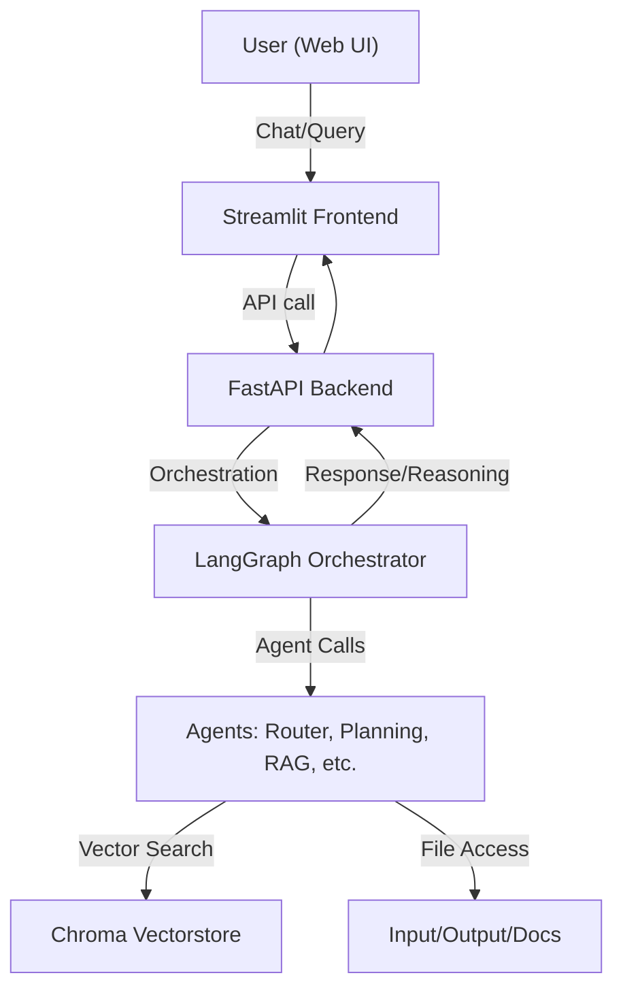

# Terradata Assignment - Thesis Analysis Agent System

A multi-agent, document-aware assistant platform using FastAPI (backend), Streamlit (frontend), and LangChain/LangGraph for orchestration.  
Supports document ingestion, retrieval, summarization, and reasoning over research and thesis documents.

**Application will be available at localhost (http://localhost:8501/) after running manual script or docker containers. For docker containers, use this address to interact in browsers (http://localhost:8501/) after spinning up containers**

Note: 
1. Langsmith supports observability and dashboard which has wide range of metrics. Hence, used langsmith dashboard instead of Grafana(https://smith.langchain.com/).
2. Advanced logging is also enabled across the system 
3. Ensure docker desktop is running in the background to build docker image
---

## **Core Architecture**
- **LangGraph Workflow**: Stateful, directed acyclic graph (DAG) for intelligent routing
- **LangSmith Integration**: Full observability and tracing of all agent interactions
- **Multi-Agent System**: Specialized agents for different types of queries
- **State Management**: Pydantic v2 models for robust state tracking

## 🚀 Features
---
- **FastAPI backend** for chat, document processing, and agent orchestration
- **Streamlit frontend** for interactive chat and reasoning visualization
- **Multi-agent architecture** (router, planning, RAG, summarization, feedback, etc.)
- **Chroma vectorstore** for semantic search
- **Portable**: All paths are project-root-relative, works on any OS
- **Dockerized**: Easy to run anywhere

## **Agent Types**
1. **Router Agent**: Intelligent routing to appropriate specialized agents
2. **RAG Agent**: Thesis document retrieval and generation for factual queries
3. **Conversation Agent**: General conversation and thesis writing guidance
4. **Summarization Agent**: Thesis document and conversation summarization
5. **Analysis Agent**: Thesis comparison, methodology analysis, innovation assessment, and web search for similar projects
6. **Error Agent**: Content moderation and safety handling

---

## **History Management**
- **Current Session**: Real-time conversation tracking
- **Mid-Term History**: 2-3 days of detailed conversation history
- **Long-Term History**: Summarized version for extended memory

**Workflow:**


---

## **Agents**
```
User Input → Router Agent → Specialized Agent → Content Moderation → Safety Check → History Update → Response
```

---

- **Frontend**: `frontend/app.py` (Streamlit)
- **Backend**: `backend/api/main.py` (FastAPI)
- **Core Logic**: `backend/core/` (agents, orchestrator, state, vectorstore)
- **Tools**: `backend/tools/` (RAG, embedding, extraction, web search)
- **Data**: `input/`, `output/`, `vector_db/`, `hf_cache/`

## **State Management**
```python
class AgentState:
    current_session: ChatSession          # Current conversation
    long_term_history: LongTermHistory   # Summarized history
    mid_term_history: MidTermHistory     # Detailed recent history
    user_input: str                      # Current user input
    response: str                        # Generated response
    route_decision: str                  # Routing decision
    current_agent: str                   # Active agent
    # ... additional metadata
```

---

## 📦 Installation

### 1. **Clone the repository**
```sh
git clone git@github.com:Vasu2803k/terradata-chat-assistant.git
cd Terradata_Assignment

### 2. Install Dependencies
```bash
pip install -r requirements.txt
```

### 3. Set Environment Variables
```bash
# Required
export GROQ_API_KEY="your_groq_api_key_here"

# Optional (for LangSmith observability)
export LANGCHAIN_API_KEY="your_langsmith_api_key_here"
```

### 4. Get API Keys
- **Groq API Key**: [Groq Platform](https://console.groq.com/) (for LLM inference)
- **LangSmith API Key**: [LangSmith](https://smith.langchain.com/) (optional for observability)

---

## 🛠️ Docker Setup (Recommended)
```sh
# Build and start all services
# Both backend and frontend now mount the project root (.:/app) for consistent imports and shared access
# The backend uses 'uvicorn backend.api.main:app ...' as its entrypoint
# The backend Dockerfile no longer contains a CMD, as commands are set in docker-compose.yml
# If you use Hugging Face models extensively, consider using a pre-built image (see Docker Hub: huggingface/transformers-pytorch-cpu)
docker compose build
docker compose up
```
- Frontend: [http://localhost:8501](http://localhost:8501)
- Backend: [http://localhost:8000](http://localhost:8000)

---

### **Manual (Local) Setup**
- Install Python 3.10+
- Create a virtual environment:
  ```sh
  python -m venv .venv
  source .venv/bin/activate  # or .venv\Scripts\activate on Windows
  pip install --upgrade pip
  pip install -r requirements.txt
  ```
- Start backend:
  ```sh
  cd backend/api
  uvicorn main:app --reload --host 0.0.0.0 --port 8000
  ```
  (If running in Docker, the command is now 'uvicorn backend.api.main:app ...')
- Start frontend:
  ```sh
  cd ../../frontend
  streamlit run app.py
  ```
  (If running in Docker, the command is now 'streamlit run frontend/app.py ...')

---

## 🧑‍💻 Usage

- Embeddings are already created for specific documents for RAG Pipeline (Upsert of new documents is not supported in this version - will be added later.)
- Chat with the assistant via the Streamlit UI.
- Reasoning steps and agent/tool invocations are shown for transparency.

### Basic Usage (Python)
```python
import asyncio
from core.orchestrator import process_message, get_history

async def main():
    # Process a user message
    result = await process_message("user123", "What is the main research methodology used in this thesis?")
    print(f"Response: {result['response']}")
    print(f"Agent Used: {result['agent_used']}")
    print(f"Route Decision: {result['route_decision']}")
```

### Advanced Usage (Multiple Messages)
```python
import asyncio
from core.orchestrator import process_message, get_history, clear_user_history, get_stats

async def advanced_demo():
    user_id = "demo_user"
    messages = [
        "Hello! How are you?",
        "What is the main research methodology used in this thesis?",
        "Can you summarize our conversation?",
        "Compare this thesis with similar projects found online."
    ]
    for message in messages:
        result = await process_message(user_id, message)
        print(f"User: {message}")
        print(f"Agent: {result['agent_used']}")
```

---

## 🔍 Observability with LangSmith

When LangSmith is enabled, you get:
- **Trace Tracking**: Complete visibility into agent workflows
- **Performance Metrics**: Response times and success rates
- **Debugging**: Detailed logs and error tracking
- **Optimization**: Insights for improving agent performance
- **LangSmith Dashboard**: **A powerful dashboard with extensive metrics, traces, and analytics for all agent interactions. This is crucial for debugging, monitoring, and optimizing your system.**

---

## 🗂️ Project Structure
```
Terradata_Assignment/
  backend/
    api/           # FastAPI app
    core/          # Orchestrator, agents, state, vectorstore
    tools/         # RAG, embedding, extraction, web search tools
    Dockerfile     # Backend Dockerfile (builds backend service image)
  frontend/
    app.py         # Streamlit app
    Dockerfile     # Frontend Dockerfile (builds frontend service image)
  input/           # Input documents
  output/          # Processed outputs
  vector_db/       # Chroma vectorstore data
  hf_cache/        # HuggingFace model cache
  scripts/         # Logging and utility scripts
  logs/            # Log files
  requirements.txt # Top-level requirements (if any shared)
  docker-compose.yml # Orchestrates both backend and frontend services
  .gitignore
  .dockerignore
  README.md
```

### 🐳 Dockerfiles & Scalability
- **backend/Dockerfile**: Builds the backend (FastAPI) service image. Handles all backend dependencies and code.
- **frontend/Dockerfile**: Builds the frontend (Streamlit) service image. Handles all frontend dependencies and code.
- This separation allows you to scale, update, or deploy backend and frontend services independently, and is a best practice for production-ready, scalable systems.
- The `docker-compose.yml` file orchestrates both services, enabling easy multi-container management and networking.

---

## 📝 Notes
- All file paths are project-root-relative for portability.
- For secrets or environment variables, use a `.env` file (not committed to git).
- For production, consider setting up persistent volumes for `vector_db/`, `hf_cache/`, and `output/`.
- The system is designed to be modular and extensible for new agents, tools, or data sources.

---

## 📚 References & Further Reading
- [LangChain](https://python.langchain.com/)
- [Streamlit](https://streamlit.io/)
- [FastAPI](https://fastapi.tiangolo.com/)
- [ChromaDB](https://www.trychroma.com/)
- [Docker Compose](https://docs.docker.com/compose/)
- [LangSmith](https://smith.langchain.com/)

---

For any questions or contributions, please open an issue or pull request! 