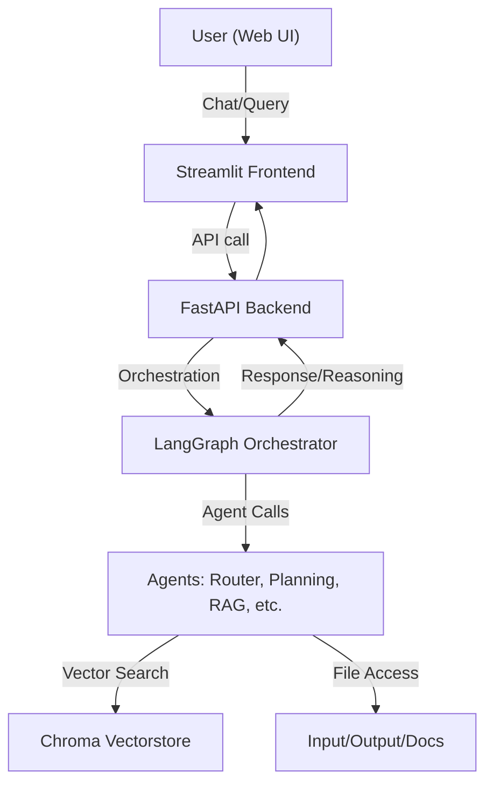

# Terradata Assignment: Intelligent Agent Chatbot - Project Report

## Objective
Design and deploy an intelligent, LLM-powered, context-aware support agent with:
- Full retrieval + reasoning pipeline (RAG + planning)
- Observability stack (logs, feedback, metrics)
- Dockerized deployment
- UI for end-user interaction

---

## Technology Stack Overview

| Component         | Technology/Stack                |
|------------------|---------------------------------|
| LLM Inference    | Groq API (LLM), LangChain       |
| Vector Store     | ChromaDB                        |
| Backend API      | FastAPI (Python 3.10+)          |
| Agent Orchestration | LangChain, LangGraph (DAG)   |
| State Management | Pydantic                        |
| Frontend (UI)    | Streamlit                       |
| Observability    | LangSmith, Advanced Logging     |
| Containerization | Docker, docker-compose          |
| Document Storage | Local filesystem (input/output) |
| Embeddings       | HuggingFace Transformers        |

---

## Core Components & Implementation

### Agent Architecture
- **Frameworks Used:** LangChain, LangGraph (DAG-style workflows), FastAPI, Streamlit
- **Multi-Agent System:**
  - **Router Agent:** Directs queries to specialized agents
  - **RAG Agent:** Retrieves and generates answers from thesis documents using Chroma vectorstore
  - **Conversation Agent:** Handles general queries and thesis writing guidance
  - **Summarization Agent:** Summarizes documents and conversations
  - **Analysis Agent:** Compares theses, analyzes methodology, and performs web search
  - **Fallback/Moderation Agents:** Handles errors and content safety
- **Retrieval Pipeline:**
  1. User query (via UI or API)
  2. Vector search (ChromaDB)
  3. LLM generates answer (Groq API)
  4. Response routed, moderated, and logged
- **State Management:** Robust session, mid-term, and long-term history using Pydantic models

### AI Observability
- **LangSmith Integration:**
  - Full trace tracking of agent workflows
  - Performance metrics (latency, success rates)
  - Debugging and error tracking
  - Optimization insights
  - **Dashboard:** [LangSmith Dashboard](https://smith.langchain.com/)
- **Advanced Logging:**
  - All user queries, agent decisions, and responses are logged
  - Latency and error logs for monitoring
- **Dashboards:**
  - LangSmith dashboard used for LLM observability

### Docker Deployment
- **Dockerized Backend:** FastAPI app for chat, orchestration, and agent logic
- **Dockerized Frontend:** Streamlit app for user interaction
- **docker-compose:** Orchestrates both services, mounts project root for shared access
- **Instructions:**
  - `docker compose build && docker compose up`
  - Local deployment and usage steps in README

### UI Interface
- **Framework:** Streamlit
- **Features:**
  - Input box for user queries
  - Display of model responses and citations
  - Chat history view
  - Reasoning steps and agent/tool invocations shown for transparency
- **Screenshots:** Included in submission (see screenshots folder or README)

---

## Deliverables
- Full project repository
- README with setup, usage, and architecture
- Inference + agent code (backend/core/agents, backend/core/orchestrator)
- UI code (frontend/app.py)
- Dockerfiles (backend, frontend)
- Screenshots of UI and LangSmith dashboard

---

## Architecture Diagram

---

## Usage Summary
- Start with `docker compose up` or run backend/frontend locally
- Access UI at [http://localhost:8501](http://localhost:8501)
- Enter queries, view responses, citations, and reasoning
- All interactions are logged and observable via LangSmith

---

## References
- [LangChain](https://python.langchain.com/)
- [Streamlit](https://streamlit.io/)
- [FastAPI](https://fastapi.tiangolo.com/)
- [ChromaDB](https://www.trychroma.com/)
- [Docker Compose](https://docs.docker.com/compose/)
- [LangSmith](https://smith.langchain.com/)

---

For questions or contributions, see the README or open an issue in the repository. 